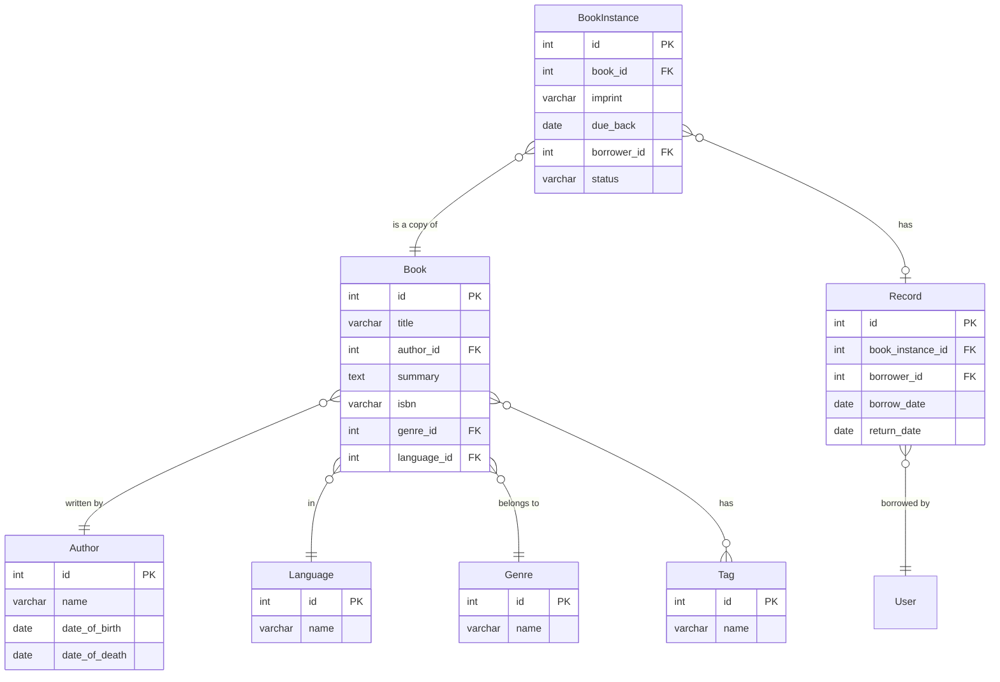

# AGENTS.md

## Project Overview

Django 6.0.5 learning log application with Tailwind CSS 4.x styling.

## Package Managers

- **Python**: uv (Python 3.13)
- **Node.js**: pnpm (Tailwind CSS only)

## Commands

```bash
# Django
uv run python manage.py runserver
uv run python manage.py migrate
uv run python manage.py createsuperuser
uv run python manage.py shell

# Tailwind CSS (development)
pnpm dev

# Tailwind CSS (production build)
pnpm build

# Generate fake data
uv run python create_fake_data.py
```

## App Structure

| App | URL Namespace | Purpose |
|-----|---------------|---------|
| `core` | `core/` | Polls/voting (under development) |
| `catalog` | `catalog` | Books, authors, genres, instances |
| `learning_logs` | `learning_logs` | Personal learning topics/entries |
| `accounts` | `accounts` | Authentication & Profile |

## Critical Constraints

- **`core/` and `learning_logs/`** - minimal changes only
- **`catalog/`** - can be significantly modified
- **`accounts/`** - authentication, registration, and profile management
- **Apps are independent**: `core`, `learning_logs`, `catalog` each have their own homepage and navigation
- Each app's header only links to its own routes, never to other apps
- **No Chinese in code** - use English only
- All app templates must inherit from `templates/base.html`
- Template structure per app: `app/templates/app/base.html`
- Static structure per app: `app/static/app/{js,css,images}/`

### Accounts App Exception

The `accounts` app follows Django's built-in auth conventions, not the project's template structure rules:

- Templates live in `accounts/templates/registration/` (Django default)
- Templates extend `base.html` directly (no app-level `base.html`)
- No own header/footer components (uses root header/footer)
- Uses `django.contrib.auth.urls` for login/logout/password flows

## Configuration

- Django settings: `config/settings.py`
- Site config: `site_config.toml` (loaded via context processor)
- Database: SQLite (`db.sqlite3`)

## Template Inheritance

```html

```

All app `base.html` files should extend the root `templates/base.html`.

## Code Style

- **Python**: format with `black`, 4-space indentation
- **Templates (HTML)**: 2-space indentation
- **JavaScript**: 2-space indentation
- **CSS**: 2-space indentation

## Styling

Uses Tailwind CSS 4.x. Input file: `static/css/input.css`, Output: `static/css/output.css`.

Run `pnpm dev` during development to watch for changes.

- Minimize raw CSS - prefer Tailwind utilities
- Keep global styles consistent - reuse rulesets in `input.css`
- Implement dark mode (can copy/paste sun/moon icons from Django admin source)

## Git Workflow

- Commit code regularly
- Each task in the task list should have at least one commit
- Do not commit directly to `main`

## Footer

Footer must provide links to other apps' root routes for cross-app navigation.

## Catalog App Refactoring

Current task: Refactor catalog app according to the ER diagram below.

### ER Diagram



### Schema Changes

- **Author**: `first_name` + `last_name` → `name`
- **Genre-Book**: M:N → 1:N (Book has `genre_id` FK)
- **Tag**: New table, M:N with Book
- **BookInstance**: Use int `id` as primary key (not UUID), remove `isbn` field
- **Record**: New table for borrowing records
