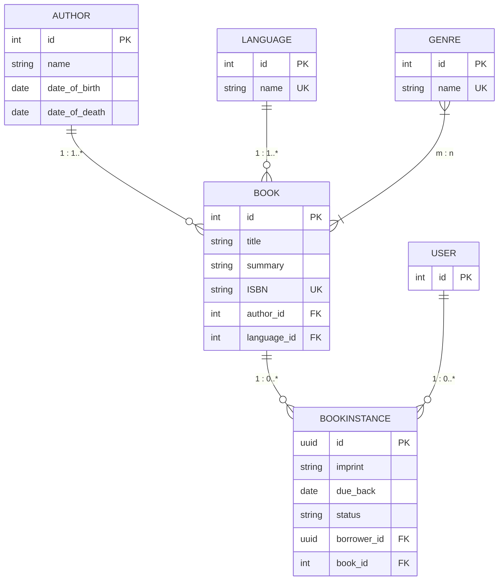

# local_library
A Django project which is simple and useful to learn the features of Django.


```text
+----------------+        +----------------+
|     GENRE      |        |     AUTHOR     |
+----------------+        +----------------+
| id (PK)        |        | id (PK)        |
| name (Unique)  |        | name           |
+----------------+        | date_of_birth  |
       ^                  | date_of_death  |
       | m                 +----------------+
       |                         ^
       | n                       | 1
+----------------+               |
|      BOOK      | <-------------+ n
+----------------+
| id (PK)        |
| title          |
| summary        |
| ISBN (Unique)  | <-----------+ n
| author_id (FK) |             |
| language_id(FK)|             |
+----------------+             |
       | 1                     |
       |                       | 
       | n                     | 1
       v                       v
+----------------+        +----------------+
|  BOOKINSTANCE  |        |    LANGUAGE    |
+----------------+        +----------------+
| id (UUID, PK)  |        | id (PK)        |
| imprint        |        | name (Unique)  |
| due_back       |        +----------------+
| status         |               
| book_id (FK)   |               
| borrower_id(FK)| 
+----------------+
```



