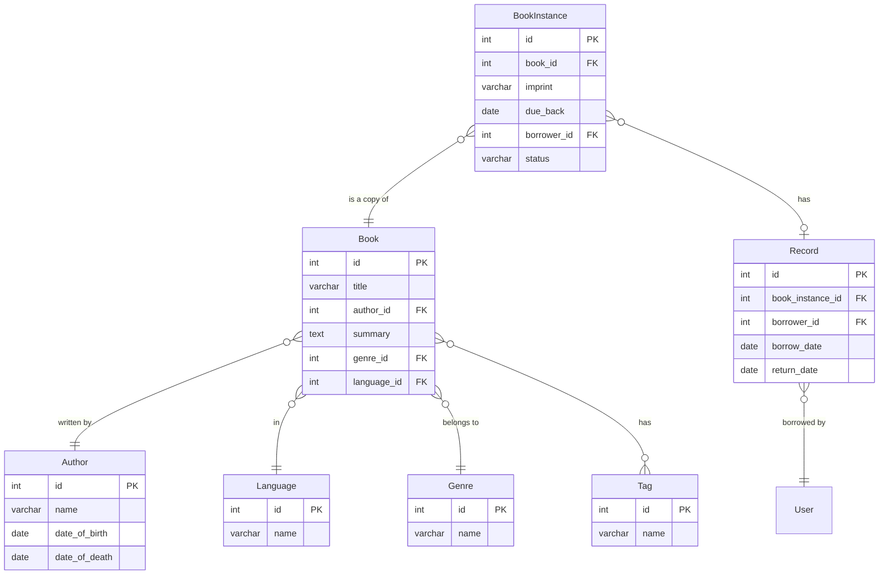

# Catalog

A local library management system built with Django.

## Features

- Browse books, authors, genres, languages, tags
- Borrow and return books (authenticated users)
- Renew borrowed books (staff with `can_mark_returned` permission)
- Staff dashboard with stats and quick actions
- Search books by title or author
- User profiles with borrowing history
- Record tracking for all borrow/return operations

## URL

`/catalog/`

## Data Model

## Key URLs

| URL | Description |
|-----|-------------|
| `/catalog/` | Home page with stats and ER diagram |
| `/catalog/books/` | Book list with search |
| `/catalog/book/<id>/` | Book detail with borrow/return actions |
| `/catalog/mybooks/` | Current user's borrowed books |
| `/catalog/myhistory/` | Current user's borrowing history |
| `/catalog/manage/` | Staff dashboard |
| `/catalog/borrowed/` | All borrowed books (staff) |
| `/catalog/records/` | All records (staff) |

## Permissions

| Permission | Description |
|------------|-------------|
| `can_mark_returned` | Renew and return books on behalf of users |
| `add/change/delete_book` | Manage books |
| `add/change/delete_author` | Manage authors |
| `add/change/delete_genre` | Manage genres |
| `add/change/delete_language` | Manage languages |
| `add/change/delete_bookinstance` | Manage book copies |
| `add/change/delete_tag` | Manage tags |
| `add/change/delete_record` | Manage records |
