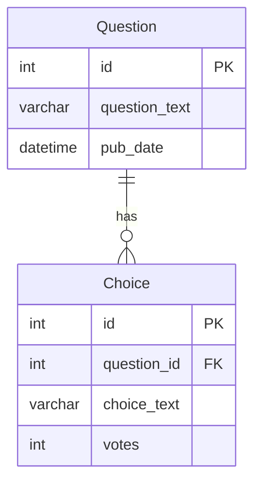

# Core (Polls)

A polling application built with Django.

## Features

- Create questions with multiple choices
- Vote on questions (atomic counting with F expressions)
- View results with progress bars
- Class-based views (ListView, DetailView)
- Pagination support

## URL

`/core/`

## Data Model

## Key URLs

| URL | Description |
|-----|-------------|
| `/core/` | App intro with ER diagram |
| `/core/questions/` | List of published questions |
| `/core/questions/<id>/` | Vote on a question |
| `/core/questions/<id>/results/` | View vote results |
