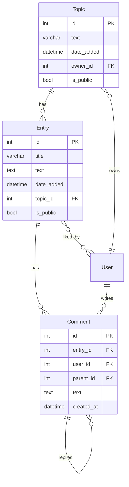

# Learning Logs

A personal learning journal with social features, built with Django and HTMX.

## Features

- Create topics and record learning entries in Markdown
- EasyMDE editor with live preview and toolbar
- Public/private visibility for topics and entries
- Like, comment, and share on public entries
- Nested comment threads (max 2 levels) with @mentions
- Infinite scroll pagination for comments (HTMX)
- Click-to-reply with auto @mention
- Collapsible reply threads
- Explore page for discovering public topics
- User profiles with public topic listings
- Tailwind CSS responsive design with dark mode

## URL

`/learning_logs/`

## Data Model

## Key URLs

| URL | Description |
|-----|-------------|
| `/learning_logs/` | App intro with ER diagram and features |
| `/learning_logs/topics/` | User's topics (login required) |
| `/learning_logs/explore/` | Public topics from all users |
| `/learning_logs/topics/<id>/` | Topic detail with entry previews |
| `/learning_logs/entry/<id>/` | Entry detail with full content, likes, comments |
| `/learning_logs/new_topic/` | Create a new topic |
| `/learning_logs/new_entry/<topic_id>/` | Add entry (EasyMDE editor) |
| `/learning_logs/edit_entry/<id>/` | Edit entry |

## API Endpoints (HTMX)

| Endpoint | Method | Description |
|----------|--------|-------------|
| `/learning_logs/entry/<id>/like/` | POST | Toggle like, returns HTML fragment |
| `/learning_logs/entry/<id>/comment/` | POST | Add comment, returns HTML fragment |
| `/learning_logs/comment/<id>/reply/` | POST | Reply to comment, returns HTML fragment |
| `/learning_logs/comment/<id>/delete/` | POST | Delete comment, returns count update |
| `/learning_logs/entry/<id>/comments/?offset=N` | GET | Load more comments (infinite scroll) |

## Tech Stack

- Django 6.0.5 + SQLite
- HTMX 2.x (interactivity without JS)
- Tailwind CSS 4.x (styling)
- EasyMDE (Markdown editor)
- Pygments (code syntax highlighting)
