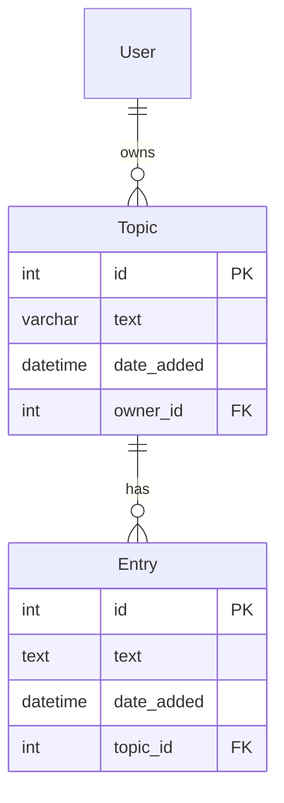

# Learning Logs

A personal learning journal built with Django.

## Features

- Create topics and record learning entries
- User isolation (each user sees only their own data)
- Edit entries to track progress over time
- Pagination support

## URL

`/learning_logs/`

## Data Model

## Key URLs

| URL | Description |
|-----|-------------|
| `/learning_logs/` | App intro with ER diagram |
| `/learning_logs/topics/` | List of user's topics |
| `/learning_logs/topics/<id>/` | Topic detail with entries |
| `/learning_logs/new_topic/` | Create a new topic |
| `/learning_logs/new_entry/<topic_id>/` | Add entry to topic |
| `/learning_logs/edit_entry/<id>/` | Edit an entry |
